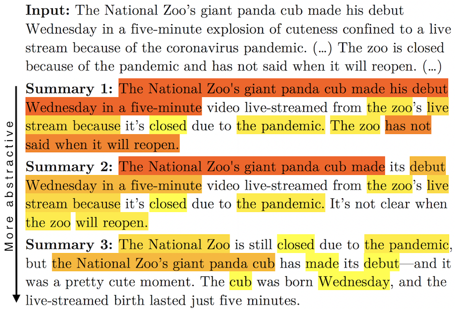

# Evaluating the Tradeoff Between Abstractiveness and Factuality in Abstractive Summarization

This repository contains the code for the [Dreyer et al (2023)](https://arxiv.org/abs/2108.02859) paper (**the dataset will be added soon**):

> Markus Dreyer, Mengwen Liu, Feng Nan, Sandeep Atluri, Sujith Ravi. 2023. Evaluating the Tradeoff Between Abstractiveness and Factuality in Abstractive Summarization. In *Proceedings of EACL Findings*. 

**Abstract:** Neural models for abstractive summarization tend to generate output that is fluent and well-formed but lacks semantic faithfulness, or factuality, with respect to the input documents. In this paper, we analyze the tradeoff between abstractiveness and factuality of generated summaries across multiple datasets and models, using extensive human evaluations of factuality. In our analysis, we visualize the rates of change in factuality as we gradually increase abstractiveness using a decoding constraint, and we observe that, while increased abstractiveness generally leads to a drop in factuality, the rate of factuality decay depends on factors such as the data that the system was trained on. We introduce two datasets with human factuality judgements; one containing 10.2k generated summaries with systematically varied degrees of abstractiveness; the other containing 4.2k summaries from five different summarization models. We propose new factuality metrics that adjust for the degree of abstractiveness, and we use them to compare the abstractiveness-adjusted factuality of previous summarization works, providing baselines for future work.

## MINT Abstractiveness Score

Our paper introduces the MINT score to measure the degree of
abstractiveness as a percentage score. It is computed based on
contiguous and non-contiguous overlap between the input and the
generated text.

To install, type:

    cd mintscore
    pip install ./
    
The `pip` command installs a script called `mint`, which you can call like this:

    # Show help text
    mint --help

    # Score output with respect to the corresponding input (line-by-line results)
    mint --source input.txt output.txt

    # Score output with respect to the corresponding input (compact results)
    mint --compact --source input.txt output.txt


## Nonlinear Abstractiveness Constraints


Our paper introduces nonlinear abstractiveness constraints to control
the degree of abstractiveness during beam decoding. Using the constraint with different values for the parameter `h`, you can generate summaries with varying degrees of abstractiveness, as in the figure below.



#### Python library `abstractive_constraints`

The nonlinear abstractiveness constraints are implemented as a Python
library called `abstractive_constraints`.

To install, type:

    cd abstractive_constraints
    pip install ./

The library provides functionality to incrementally build a target
sequence, compute matches against source tokens and then score (or,
penalize) the matches. It can be used in any beam decoder.

#### Integration into Fairseq

We provide a reference implementation of using the
`abstractive_constraints` library in the
[Fairseq](https://github.com/facebookresearch/fairseq) decoder.

To run it, first install Fairseq into a parent directory, then apply
our diff file `fairseq-1e40a48.diff`, which inserts calls to the
`abstractive_constraints` library:

```
cd ~
git clone https://github.com/pytorch/fairseq.git
cd fairseq
git reset --hard 1e40a48
pip install --editable ./
patch -p0 < ~/abstractive-factual-tradeoff/fairseq-1e40a48.diff # from this repo
```

You can then run inference with a BART model using abstractiveness constraints as follows.

First, download the `bart.large.cnn` model (see [here](https://github.com/facebookresearch/fairseq/blob/main/examples/bart/README.md)) and unpack it:

```
mkdir -p ~/fairseq/models
cd ~/fairseq/models
wget https://dl.fbaipublicfiles.com/fairseq/models/bart.large.tar.gz
tar -xzf bart.large.tar.gz
```

Then, use our `misc/bart_decode.py` script, which takes an
`--extractive-penalty` as a command line option to control
abstractiveness:

```
python ${HOME}/abstractive-factual-tradeoff/misc/bart_decode.py \
  --extractive-penalty 'log_exp(2,2.402244)' \
  --gpus=4 --batch-size=4 --min-len=55 --max-len-b=140 \
  --model=${HOME}/fairseq/models/bart.large.cnn/model.pt \
  --task=${HOME}/fairseq/models/bart.large.cnn \
  --output output.txt input.txt
```

The `log_exp(k,c)` stands for the function `x**k/c**k`, where `x` is the length of an extractive fragment. In the example command above, we use an exponent of `k=2` (see Footnote 3 in our paper) and `c=2.402244`. This corresponds to the (negative) log of Equation 1 in our paper with `h=2`, see Appendix B.

## Datasets

*Coming soon*

## Citation

```
@inproceedings{dreyer-etal-2023-tradeoff,
    title = "Evaluating the Tradeoff Between Abstractiveness and Factuality in Abstractive Summarization",
    author = "Dreyer, Markus  and
      Liu, Mengwen  and
      Nan, Feng  and
      Atluri, Sandeep and 
      Ravi, Sujith",
      booktitle = "Findings of the European Association for Computational Linguistics: EACL 2023",
      month = may,
      year = "2023",
      address = "Dubrovnik, Croatia",
      publisher = "Association for Computational Linguistics",
      url = "https://arxiv.org/abs/2108.02859"
}
```

## Security

See [CONTRIBUTING](CONTRIBUTING.md#security-issue-notifications) for more information.

## License

This project is licensed under the MIT-0 License.